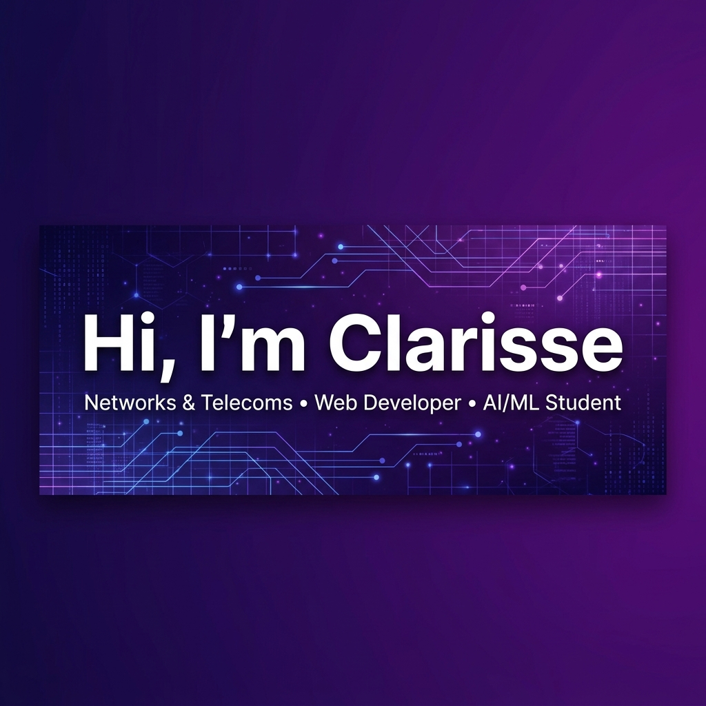

  

  
  
  

---

<table border="0">
  <tr>
    <td width="50%" valign="top">
      <h3>🙋 À propos</h3>
      
Étudiante en <strong>Master 1 Réseaux & Télécommunications</strong>. Je me passionne pour la connectivité des infrastructures réseaux, le développement d'applications web modernes et la recherche de solutions intelligentes grâce à l'Intelligence Artificielle et à la Data Science.

      <ul>
        <li>🖥️ Actuellement concentrée sur les architectures réseaux d'entreprise et le développement web.</li>
        <li>🎓 En apprentissage continu — Réseaux, IA, Cloud & Web.</li>
        <li>💬 Français (courant), Anglais (technique).</li>
        <li>⚡ <em>"First, solve the problem. Then, write the code."</em></li>
      </ul>
    </td>
    <td width="50%" valign="top">
      <h3>🎓 Formation</h3>
      
<strong>Master 1 - STIC . Réseaux & Télécoms</strong> 
      Réseaux Télécommunications et Réseaux 
      <em>École Supérieure Polytechnique d'Antananarivo (ESPA)</em>

      
Formation théorique et pratique alliant infrastructures réseaux, télécommunications et systèmes d'information, complétée par du développement web et de l'analyse de données avec l'IA.

    </td>
  </tr>
</table>

---

### ⚙️ Stack Technique

  <strong>Frontend & Frameworks</strong> 
  
  
  
  
  
  

  <strong>Backend & Bases de données</strong> 
  
  
  
  
  

  <strong>Intelligence Artificielle & Data Science</strong> 
  
  
  
  
  

  <strong>Réseaux & Infrastructure</strong> 
  
  
  
  
  
  

---

### 📊 Statistiques GitHub

  
  

  

---

### 📬 Me contacter

  

  <strong>Thanks for visiting!</strong>

